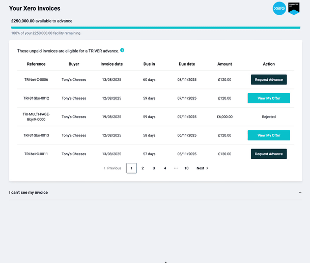
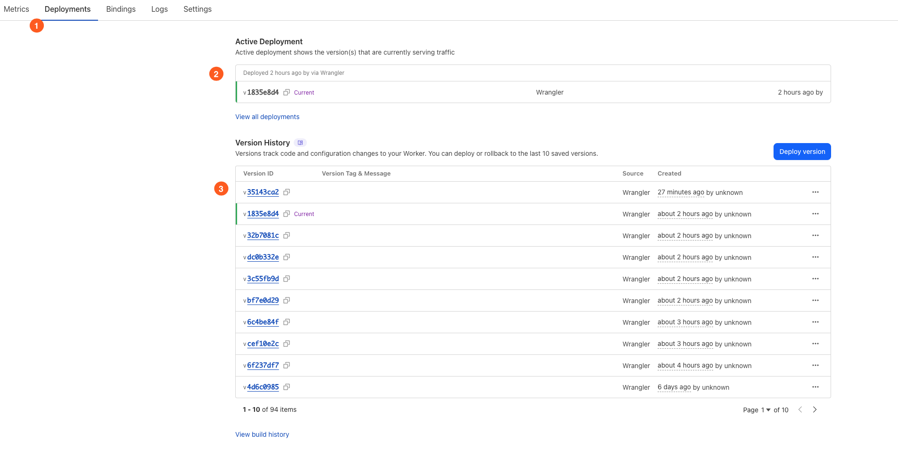
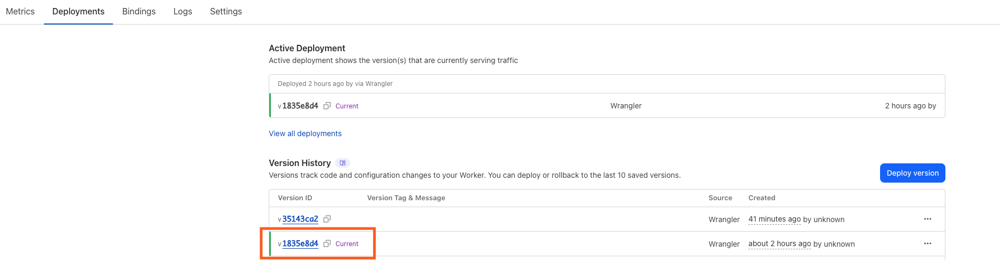
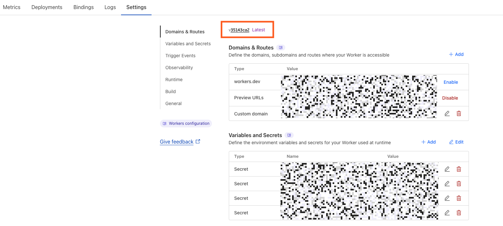

Agenda 
---
<!-- incremental_lists: true -->
<!-- list_item_newlines: 3 -->
- Intro to hosting with Cloudflare
- Demo
- Living with Cloudflare - some drawbacks
<!-- end_slide -->

Who are we
---

<!-- column_layout: [1, 1] -->
<!-- column: 0 -->
<!-- alignment: center -->
Connor Adams

Staff Engineer @ TRIVER LTD
<!-- column: 1 -->
Mark Ridge

Software Engineer @ TRIVER LTD
<!-- end_slide -->
Poll time
---
<!-- jump_to_middle -->
<!-- alignment: center -->
What do you host SvelteKit on?
<!-- end_slide -->
Sveltekit Hosting - there are many options!
---
<!-- end_slide -->
Sveltekit Hosting - there are many options!
---
<!-- alignment: center -->

<!-- end_slide -->
Sveltekit Hosting - there are many options!
---
<!-- alignment: center -->

<!-- end_slide -->
Sveltekit Hosting - there are many options!
---
<!-- alignment: center -->

<!-- end_slide -->
Sveltekit Hosting - there are many options!
---
<!-- alignment: center -->

<!-- end_slide -->
Sveltekit Hosting - there are many options!
---
<!-- alignment: center -->

<!-- end_slide -->
Sveltekit Hosting - there are many options!
---
<!-- alignment: center -->

<!-- end_slide -->
<!-- jump_to_middle -->
2 years ago...
---
<!-- end_slide -->

<!-- end_slide -->

<!-- alignment: center -->
<!-- column_layout: [1, 1] -->
<!-- column: 0 -->
<!-- pause -->
✅ Official adapter
<!-- pause -->
<!-- column: 1 -->
✅ Already using Cloudflare
<!-- end_slide -->
<!-- jump_to_middle -->
Demo time!
---
<!-- end_slide -->
<!-- jump_to_middle -->
Life in the Cloud - what has flared up?
---
<!-- end_slide -->
Pages vs Workers
---
<!-- alignment: center -->
<!-- column_layout: [10, 1, 10] -->
<!-- column: 0 -->
Pages
***
❌ Early all in one offering
<!-- new_line -->
❌ Only real-time logs
<!-- new_line -->
❌ Limited flexibility
<!-- column: 2 -->
Workers
***
✅ Serverless platform, now host apps
<!-- new_line -->
✅ Logs with logpush
<!-- new_line -->
✅ Durable Objects, Cron triggers
<!-- pause -->
<!-- reset_layout -->
<!-- alignment: center -->
<!-- new_lines: 1 -->
> [!warning]
> Cloudflare now advise starting with workers. There is also a migration guide (and an llm prompt)!
<!-- end_slide -->
Preview deployments
---

<!-- end_slide -->
Preview deployments
---

<!-- end_slide -->
Env strangeness
---

<!-- end_slide -->
Env strangeness
---

<!-- end_slide -->
Conclusion - give it a go
---
<!-- pause -->
<!-- incremental_lists: true -->
💡 What Cloudflare offers 
<!-- new_line -->

<!-- pause -->
💡 How you get started 
<!-- new_line -->

<!-- pause -->
💡 Some of the drawbacks

<!-- pause -->
<!-- jump_to_middle -->
<!-- new_lines: 3 -->
> [!warning]
> This is not necessarily the best place to host SvelteKit. 
> Give it a go!
<!-- end_slide -->
<!-- jump_to_middle -->
Questions?
---